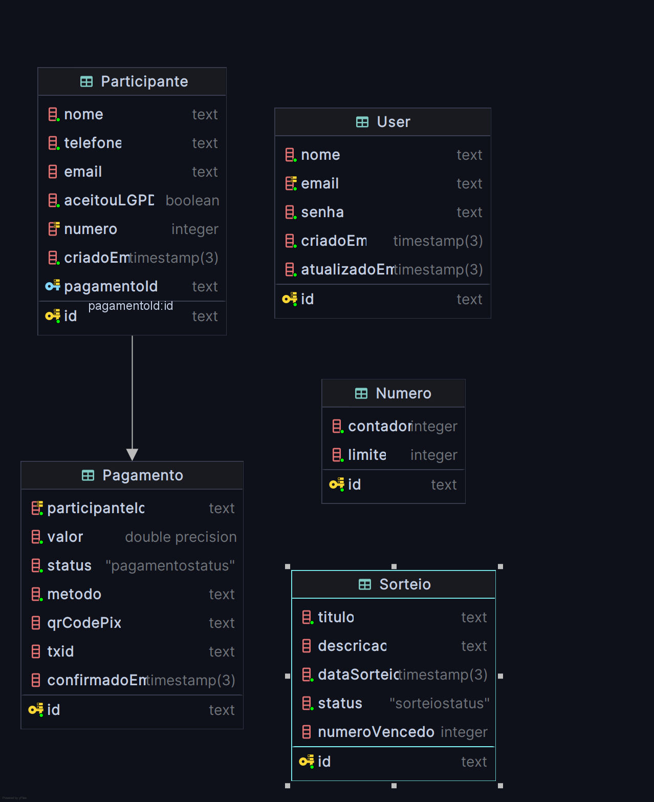

# 📄 README — Banco de Dados "Ação Entre Amigos"

## Visão geral

Estrutura de banco projetada para o sistema de **Ação Entre Amigos**, com controle de sorteios, pagamentos,
participantes, e numeração sequencial.

---

## Models

### 1. User

| Campo        | Tipo     | Descrição                                    |
|--------------|----------|----------------------------------------------|
| id           | String   | PK, gerado com `cuid()`                      |
| nome         | String   | Nome completo do usuário                     |
| email        | String   | Email único                                  |
| senha        | String   | Hash da senha                                |
| criadoEm     | DateTime | Data de criação                              |
| atualizadoEm | DateTime | Última atualização automática (`@updatedAt`) |

---

### 2. Participante

| Campo       | Tipo       | Descrição                                              |
|-------------|------------|--------------------------------------------------------|
| id          | String     | PK, gerado com `cuid()`                                |
| nome        | String     | Nome do participante                                   |
| telefone    | String     | Telefone de contato                                    |
| email       | String?    | Email opcional                                         |
| cpfCnpj     | String?    | CPF ou CNPJ opcional                                   |
| aceitouLGPD | Boolean    | Indica se aceitou os termos da LGPD                    |
| numero      | Int?       | Número único do participante (pode ser null até gerar) |
| pagamentoId | String?    | FK única para `Pagamento`                              |
| criadoEm    | DateTime   | Data de cadastro                                       |
| pagamento   | Pagamento? | Relacionamento 1:1 com `Pagamento`                     |

---

### 3. Pagamento

| Campo          | Tipo      | Descrição                                             |
|----------------|-----------|-------------------------------------------------------|
| id             | String    | PK, gerado com `cuid()`                               |
| participanteId | String    | FK única para `Participante`                          |
| valor          | Float     | Valor do pagamento                                    |
| status         | Enum      | Status do pagamento (PENDENTE, CONFIRMADO, CANCELADO) |
| metodo         | String    | Forma de pagamento (PIX, cartão, boleto, etc.)        |
| qrCodePix      | String?   | Chave ou imagem base64 do QR Code PIX                 |
| txid           | String?   | Identificador da transação PIX                        |
| confirmadoEm   | DateTime? | Data/hora de confirmação                              |

---

### 4. Numero

| Campo    | Tipo   | Descrição                    |
|----------|--------|------------------------------|
| id       | String | PK, gerado com `cuid()`      |
| contador | Int    | Contador atual               |
| limite   | Int    | Quantidade máxima de números |

---

### 5. Sorteio

| Campo          | Tipo     | Descrição                                            |
|----------------|----------|------------------------------------------------------|
| id             | String   | PK, gerado com `cuid()`                              |
| titulo         | String   | Nome ou título do sorteio                            |
| descricao      | String?  | Detalhes opcionais                                   |
| dataSorteio    | DateTime | Data marcada para o sorteio                          |
| status         | Enum     | Status do sorteio (AGUARDANDO, REALIZADO, CANCELADO) |
| numeroVencedor | Int?     | Número vencedor (refere-se a `Participante.numero`)  |

---

## Enums

**PagamentoStatus**

* `PENDENTE`
* `CONFIRMADO`
* `CANCELADO`

**SorteioStatus**

* `AGUARDANDO`
* `REALIZADO`
* `CANCELADO`

---

## Fluxo principal

1. Participante é cadastrado com ou sem CPF/CNPJ.
2. O sistema gera um número único (`numero`) de acordo com o contador do model `Numero`.
3. Pagamento é registrado com status inicial `PENDENTE`.
4. Ao confirmar o pagamento, a data `confirmadoEm` é atualizada.
5. No sorteio, é escolhido um número vencedor, gravado em `Sorteio.numeroVencedor`.
